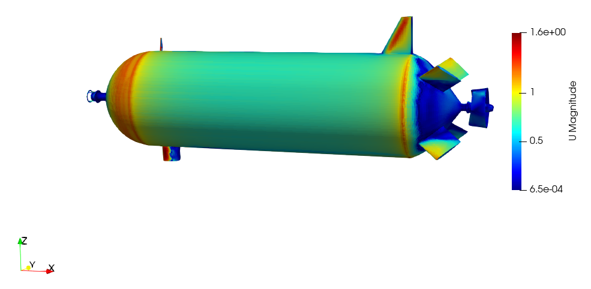
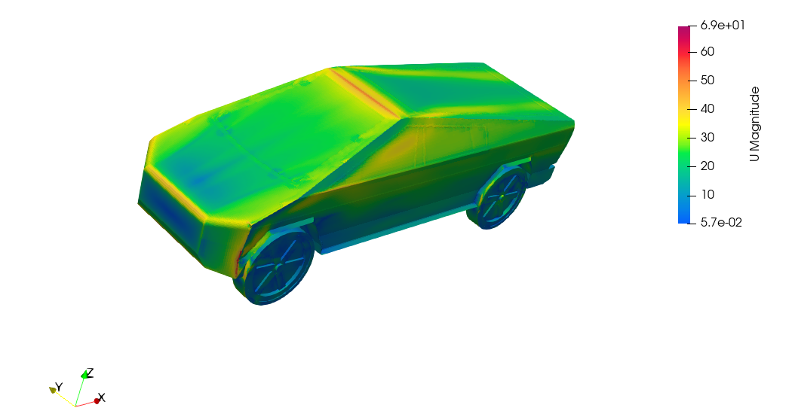
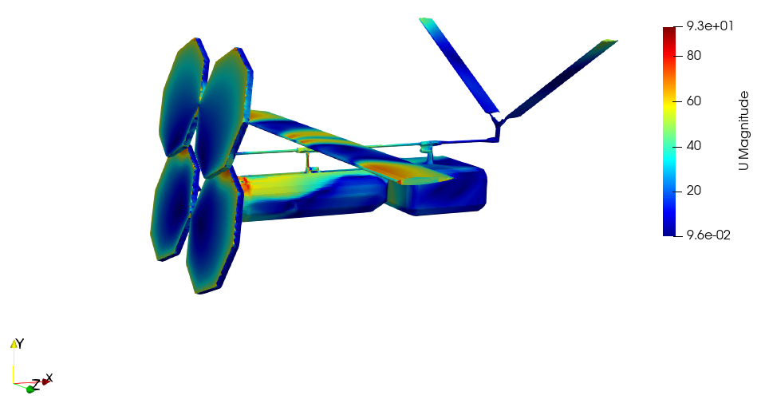
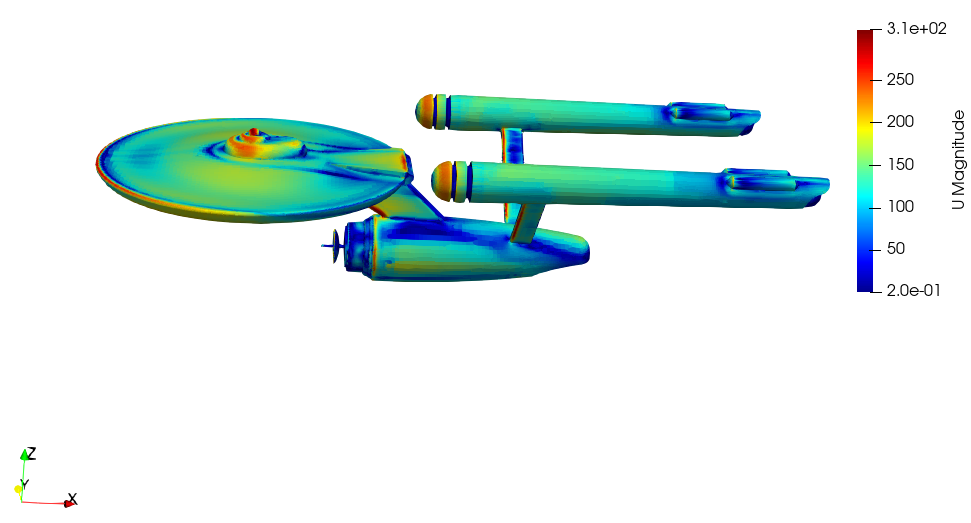

# Anvil
An open-source SciML tool for CFD-based design evaluator integrated with AI-based optimization algorithms and data generation capability for training and  surrogate modeling. For this end we used two domain specific engineering tools:
a. OpenFOAM : A CFD analysis tool
b. FreeCAD : A CAD design tool
Apart form engineering tools, we integrated data science and AI tools in unison that may be useful for scientific Machine Learning efforts.

The Anvil tool works in three mode:
1. Run the CFD analysis on a single STL file : On a given configuration file, and STL of the design, the tool runs the CFD analysis and store the result.  User does not need to go into the details of understanding the OpenFOAM and its settings. The experiment setting is provided by user in JSON configuration file and rest is taken care by the tool.
2. Data generation mode: On a given parametric CAD seed design, design space and budget of evaluation , the CFD outcome data is generated and stored . This may be useful in studying effect of changes in shape on the drag or lift values or creating a low fidelity surrogate model for the CFD process in context of the design. The data generation process is completely automatic. On a give budget, User can choose the kind of sampling method and let the experiment run automatically and store the data.  
3. Optimization mode: In this mode, the AI-based optimization method called Bayesian optimization (BO) is run with user defined acquisition function. BO is highly sample efficient so it is the perfect choice in this setting due to expensive to evaluate CFD analysis.

Both 'data generation' and 'optimization' modes are automatic that speed up the scientific work.  

## Installation requirement:
Operating system: Ubuntu : 20.04

CFD sim: Appropriate version of openFOAM should be installed. Installation instructions of the used version can be found here:
https://develop.openfoam.com/Development/openfoam/-/wikis/precompiled/debian

Freecad: FreeCAD 0.20.1 version. FreeCAD is used to modify the shape and generate STL file from given parametric CAD seed and input parameter. Installation instructions can be found here : https://wiki.freecad.org/Installing_on_Linux

GpyOpt: https://sheffieldml.github.io/GPyOpt/

PyDoE: https://pythonhosted.org/pyDOE/

python_requires='>=3.6',

etc.

The automatic installation script along with Docker image would be provided soon.

## Folders of interest:
### Automization:
 - This folder consist of class and method to run freecad to generate stl file on given seed design and input config parameter file.
 - Contains classes and methods that runs to simulate CFD on given input foam configuration.

#### Subfolders:
- src : Contain all the source files for running an experiment.
- usr_input : User artifacts (parametric CAD seed design and configuration file) must be stored here. This is the only folder user need to work on.
- data : simulation data is stored. The name of data file would be same as name of parametric seed design.

For running the tool: go to **src** folder and run: 'python main.py'

### Artifacts:
 It is storage of parametric cad seed design and other STL file used for experimentation in this project.

### Experiments:
 Demonstration of the tool's capability by few experiments.
 Some interesting simulations ran and its flow field at surface layer of the design is shown below:
 
 
 
 

 For more information about tool functioning, Please refer the wiki of this folder:  https://github.com/symbench/Anvil/wiki
